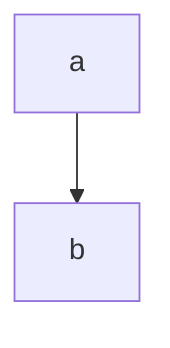
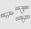

+ [`otherInfo`](#otherinfo)
+ [`markdown`](#markdown)
+ [`magic tool` !](#magic-tool-)
+ [`makefile`](#makefile)
+ [`排序`](#排序)
+ [插入](#插入)
  + [直接](#直接)
  + [二分](#二分)
  + [二路归并](#二路归并)
  + [表](#表)
  + [希尔](#希尔)
+ [交换](#交换)
  + [冒泡](#冒泡)
  + [快速 !](#快速-)
+ [选择](#选择)
  + [简单](#简单)
  + [树形选择(冠军)](#树形选择冠军)
  + [堆](#堆)
+ [归并 !](#归并-)
+ [基数](#基数)

[go search](Serch.md)  
[go tree](tree.md)
# `otherInfo`
```
printf wrong use gbk
```
# `markdown`   

| you     |her      |she      |
| :-: | :-: | :-: |  
|   are   |    not  |   well   |  

```markdown

# []() c++ []: ~ * - 

1. yuo
   1. her 

- [X] [插入](##插入)

[](##交换)

ctr shift p
```

```flow
st=>start: start
co=>condition: is you
e=>end: end
st(right)->co
co(yes)->e
```
# `magic tool` 
```
gm convert 齿轮.png -resize 32X32 齿轮.png
```
# `makefile` 
```makefile
all:
    gcc *.cpp -o *.exe
test:
    @echo i am test
```
# `排序`
# 插入  
## 直接
```c++
void InertSort(SqList &L){
for (int i = 2; i <= L.Length; ++i)
    {
        if (LT(L.r[i].key,L.r[i-1].key)) {
            L.r[0]=L.r[i];
            L.r[i]=L.r[i-1];

            int j;
            for( j=i-1;LT(L.r[0].key,L.r[j].key);--j){
                L.r[j]=L.r[j-1];
            }
            L.r[j+1]=L.r[0];
        }
    }      
}
```
## 二分
```c++
void BInsertSort(SqList &L1){
for (int i = 2; i <= L1.Length; i++)
    {
        L1.r[0]=L1.r[i];
        int low ,hight,m;
        low=1,hight=i-1;
        while(low<=hight){
            m=(low+hight)/2;
            if(LT(L1.r[0].key,L1.r[m].key)) hight=m-1; 
            else low =m+1;
        }
        for(int j=i-1;j>=hight+1;j--){
            L1.r[j+1]=L1.r[j];
        }
        L1.r[hight+1]=L1.r[0];
        //after hight low
    }
}
```
## 二路归并
```c++
void WInsert(SqList L, SqList &L2,int &fir,int &fin){
    L2.r[1]=L.r[1];
    // int fir ,fin;
    fir=fin=1;
    for (int i = 2; i <= L.Length; i++)
    {
        L2.r[0]=L.r[i];
        if( LT(L.r[i].key,L.r[1].key)){
        fir=(fir-2+MAXSIZE)%MAXSIZE+1; //fir to MXASIZE
        int j;
        for (j = fir+1;LT(L2.r[j].key,L2.r[0].key)&& j <=MAXSIZE ; j++)
        {
             L2.r[j-1]=L2.r[j];
        }
        L2.r[j-1]=L2.r[0];
        }
        else {
        fin=(fin+MAXSIZE)%MAXSIZE+1;
       int j;
        for (j = fin-1;LT(L2.r[0].key,L2.r[j].key)&& j >=2 ; j--)
        {
             L2.r[j+1]=L2.r[j];
        }
        L2.r[j+1]=L2.r[0];
        }
    }
}
```
## 表 
```c++
void TableInsertSort(SqList &SL){ 
    SL.r[0].key=0x7fffffff;
    SL.r[0].next=1;
    SL.r[1].next=0;
    int j,pre;
    for (int i = 2; i <=SL.Length; i++)
    {
       j=SL.r[0].next;
       pre=0; //here
      while(LT(SL.r[j].key,SL.r[i].key)){
          pre=j;
          j=SL.r[j].next;
      }
        SL.r[pre].next=i;
        SL.r[i].next=j;
    } 
}
//reset position
void RangeOfTableInsert(SqList &SL){
    int j,pre=SL.r[0].next;
    RedType buf;
    for (int i = 1; i < SL.Length; i++)
    {
        while(pre<i) //moved
        pre=SL.r[pre].next;
        j=SL.r[pre].next;
        if(pre!=i){
            buf= SL.r[i];
            SL.r[i]=SL.r[pre];
            SL.r[pre]=buf;
            SL.r[i].next=pre; //moved's target
        }
        pre=j;
    }
}
```
## 希尔
```c++
void ShellSort(SqList &L5 ,int dk[]){
    for (int i = 2; i >=0; i--)
    {
        for (int j =dk[i]+1 ; j <=L5.Length; j++)
        {
            if(LT(L5.r[j].key,L5.r[j-dk[i]].key)){
                L5.r[0]=L5.r[j];
                int k;
                for (k = j-dk[i]; LT(L5.r[0].key,L5.r[k].key)&&k>0; k-=dk[i])
                {
                    L5.r[k+dk[i]]=L5.r[k];
                }
                L5.r[k+dk[i]]=L5.r[0];
            }
        }
    }
}
```
# 交换

## 冒泡
```c++
void BableSort(SqList &L6){
    for (int i = L6.Length; i >=1; i--)
    {   
        RedType buf;
        for (int j = 1; j <=i; j++)
        {
            if(LT(L6.r[j+1].key,L6.r[j].key)){
                buf=L6.r[j+1];
                L6.r[j+1]=L6.r[j];
                L6.r[j]=buf;
            }
        }    
    }
}
```
## 快速 
```c++
void Qsort(SqList &L6,int low,int hight){
    if (low <hight) //not while
    {
        int p=Partition(L6,low,hight);
        Qsort(L6,low,p-1);
        Qsort(L6,p+1,hight);
    }
}
int Partition(SqList &L6,int low,int hight){
    L6.r[0]=L6.r[low];
    int p=L6.r[low].key;
    while(low<hight){
        while(low<hight&& LQ(p,L6.r[hight].key)) hight--;
        L6.r[low]=L6.r[hight];
        while(low<hight&& LQ(L6.r[low].key,p)) low++; //repeat 
        L6.r[hight]=L6.r[low];
    }
    L6.r[low]=L6.r[0];  //low = hight h<p low>p
    return low;
}
```
# 选择

## 简单
```c++
void SelectSort(SqList &L6){
    for (int i = 1; i < L6.Length; i++)
    {
        int min =FindMin(L6,i,L6.Length);
        RedType buf;
        if(min-i){ //not i ,not while
            buf=L6.r[min];
            L6.r[min]=L6.r[i];
            L6.r[i]=buf;
        }
    }
}
int FindMin(SqList &L6 ,int low,int hight){
    int min =low;
    low--;
    while (low<hight) // one with me
    if (LT(L6.r[++low].key,L6.r[min].key)) min=low;
    return min;
}
```
## 树形选择(冠军)
## 堆
```c++
void HeapSort(SqList &L6){
    //init heap
    for (int i = L6.Length/2; i >0; i--)
    {
        HeapAdjust(L6,i,L6.Length);
    }
    for (int i = L6.Length; i>1; i--)
    {
        //low(max) to tail
        RedType buf;
        buf=L6.r[i];
        L6.r[i]=L6.r[1];
        L6.r[1]=buf;
        HeapAdjust(L6,1,i-1);
    }
}
void HeapAdjust(SqList &L6,int low ,int hight){
    // just low
    RedType buf=L6.r[low];
    for (int i = low*2; i <=hight; i*=2) //child
    {
        //choice max, have right
        if(i<hight&& LT(L6.r[i].key,L6.r[i+1].key))i++;
        //right position
        if(LQ(L6.r[i].key,buf.key)) break;
        L6.r[low]=L6.r[i];
        low=i;
    }
    // low is riht now
    L6.r[low]=buf;
}
```
# 归并 

```c++
void Msort(SqList SL,SqList &L6,int low,int hight){
    //sort if posible 
    //i can sort
    SqList buf;
    int m=(low+hight)/2;
    
    if(low==hight) L6.r[low]=SL.r[low];
    else{
    Msort(SL,buf,low,m);
    Msort(SL,buf,m+1,hight);
    Merge(buf,L6,low,m,hight);
    }
}
void Merge(SqList LS,SqList &L6,int low,int m,int hight){
    //your LS is sorted in two part,sliced by m
    // small 112 LS→L6
    int fl=low,fh=m+1,sl=low;

    while(fl<=m&&fh<=hight)
        if(LT(LS.r[fl].key,LS.r[fh].key)) L6.r[sl++]=LS.r[fl++];
        else L6.r[sl++]=LS.r[fh++];

    while(fl<=m) L6.r[sl++]=LS.r[fl++];
    while(fh<=hight) L6.r[sl++]=LS.r[fh++];

}
```
# 基数


